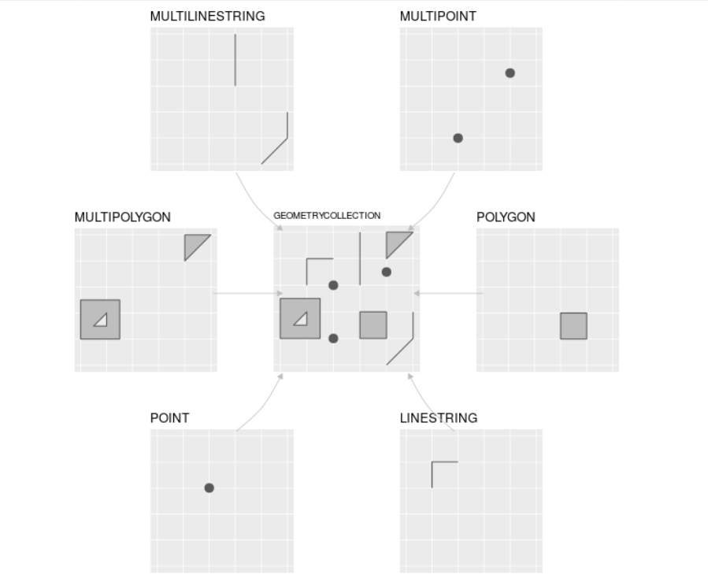

# Información y datos geográficos

La información y los datos geográficos (a veces llamados también espaciales o geoespaciales) hacen referencia a la localización de un objeto o fenómeno en un espacio geográfico. Esta referencia puede ser implícita (ej. mediante el nombre de un lugar) o explícita, en un [sistema de coordenadas](https://en.wikipedia.org/wiki/Geographic_coordinate_system).

Hay dos tipos de datos geográficos: vectoriales y raster

## Datos vectoriales
El modelo vectorial de datos está basado en puntos localizados en un [sistema de referencia de coordenadas (CRS)](https://en.wikipedia.org/wiki/Spatial_reference_system). Los puntos individuales pueden representar objetos independientes (ej. la localización de un poste eléctrico o de una cabina telefónica) o pueden también agruparse para formar geometrías más complejas como líneas o polígonos. Por lo general, los puntos tienen solo dos dimensiones (x, y), a las que se les puede agregar una tercera dimensión _z_, usualmente correspondiente a la altitud sobre el nivel del mar.

### El estándar _Simple Features_
[_Simple Features_](https://www.ogc.org/standards/sfa) (o _Simple Feature Access_) es un estándar abierto de la [Organización Internacional de Estandarización (ISO)](https://iso.org/) y del [_Open Geospatial Consortium_ (OGC)](https://www.ogc.org/) que especifica un modelo común de almacenamiento y acceso para geometrías de dos dimensiones (líneas, polígonos, multilíneas, multipolígonos, etc.). El estándar es implementado por muchas bibliotecas y bases de datos geoespaciales como [sf](https://cran.r-project.org/web/packages/sf/index.html), [GDAL](https://gdal.org/), [PostgreSQL/PostGIS](https://en.wikipedia.org/wiki/PostGIS), [SQLite/SpatiaLite](https://www.gaia-gis.it/fossil/libspatialite/), [Oracle Spatial](https://www.oracle.com/database/technologies/spatialandgraph.html) y [Microsoft SQL Server](https://www.microsoft.com/en-us/sql-server/), entre muchas otras.

La especificación define 17 tipos de geometrías, de las cuales siete son las más comúnmente utilizadas. Estas últimas se muestran en la siguiente figura:

